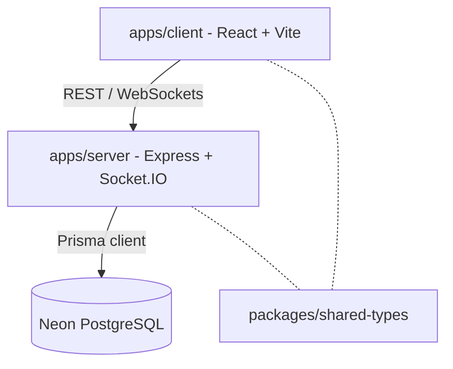

# 📖 BookChat — Project Summary & Architecture Overview

This document provides a complete technical and product summary of **BookChat**, a real-time messaging application designed to look and feel like a physical, handcrafted book/journal.

---

## 1. Architecture

BookChat is structured as a full-stack **TypeScript monorepo** using npm/pnpm workspaces. It is divided into three main packages:



*   **Frontend**: Built with **React + Vite** as a Single Page Application (SPA), styled with custom CSS Modules/Tailwind, and utilizing libraries like **Framer Motion** or **react-pageflip** for physical skeuomorphic transitions. Deployed on **Netlify**.
*   **Backend**: Powered by **Node.js, Express, and Socket.IO** for real-time messaging, state synchronization, and room management. Deployed on **Render**.
*   **Database**: **PostgreSQL** hosted serverless on **Neon**, leveraging connection pooling.
*   **ORM**: **Prisma ORM** for database migrations, model schema definition, and type-safe queries.
*   **Authentication**: JWT-based session model (short-lived Access JWT and long-lived Refresh JWT) stored in secure, `httpOnly` cookies to protect against XSS token theft.

---

## 2. Page Flows

The visual workflow simulates interacting with a physical book. The camera is conceptually fixed top-down over a study desk.

1.  **Auth Screen (Closed Book)**: A centered, rendered leather hardcover book resting on a wooden desk. Sign-in/up inputs are visually debossed directly onto the book cover.
2.  **Opening Animation**: On login, the book cover opens toward the camera, and the pages fan out in 3D space, transitioning into the main interface.
3.  **Onboarding (Name Capture & Preamble)**:
    *   *Name Capture*: A centered, sepia-dimmed card popup prompting for a display name (required). If a user refreshes/bypasses, the router forces this modal until completed.
    *   *Preamble*: A stylized frontispiece page of a novel featuring serif typography, a drops cap, and the four "house rules."
    *   *Guided Tour*: Visual ink-underline highlights introducing UI features (sidebar, composer, share button, theme switcher).
4.  **Book Selection (Shelf)**: Displays joined Books if no default is chosen, with "Create Book" and "Join via Code" options. The first created book is automatically set as the default book.
5.  **Main Book View**: The persistent interface splitting layout into a navigation spine/sidebar on the left and a ruled notebook page on the right.

---

## 3. Components

The main layout is enclosed within a `FrameShell` that controls the surrounding themed assets (e.g. wood grain desk, library shelf).

| Component | Description |
|---|---|
| `FrameShell` | Swaps the surrounding environment chrome (Notebook, Archive Cabinet, Library, Corkboard). |
| `LeftHardcoverNav` | Left icon rail for navigating: New book, Favorites, Book list, Trash, Settings. |
| `LeftPageConversationList` | The sidebar listing conversations, grouped by `Today`, `Yesterday`, and `This Week` with a folded-corner aesthetic. Scoped per-Book. |
| `SidebarSearch` | Integrated search box filter within the sidebar. |
| `NewPageButton` | "+ New Page" trigger to start DMs ("Write to a member...") using a styled dropdown select. |
| `PageHeader` | Serif title, metadata ("Created," "Updated"), and utility buttons (pin, share/invite, dropdown). |
| `RibbonBookmarkTab` | Top-right hanging ribbon acting as a secondary shortcut for invites. Sways slightly on hover. |
| `MessageEntry` | Custom hand-written entry styling with user avatar (circle) / system avatar (feather pen) without standard chat bubbles. Uses dry ink bleed SVG filter animations on arrival. |
| `ComposerBar` | Bottom pill-shaped text input featuring an attach button, placeholders, and a fountain pen send indicator. |
| `ThemePaletteStrip` | Row of colored swatches for previewing frames inside the settings or pull-tab panels. |
| `StickyNoteContainer` | Anchor zone coordinator managing active sticky note notifications. |
| `StickyNoteNotification` | Skeuomorphic paper note card with gravity drop physics. |
| `LiveWritingPen` | Floating skeuomorphic fountain pen overlay anchored to the composer writing cursor. |

---

## 4. Database Schema (Prisma)

The data model uses six primary collections to manage users, books, memberships, and messages:

```prisma
model User {
  id              String    @id @default(cuid())
  email           String    @unique
  passwordHash    String
  displayName     String
  hasSeenPreamble Boolean   @default(false)
  hasSeenTour     Boolean   @default(false)
  themePreference String    @default("paper")
  defaultBookId   String?
  createdAt       DateTime  @default(now())
  updatedAt       DateTime  @updatedAt

  memberships     BookMember[]
  messages        Message[]
  createdBooks    Book[]              @relation("BookCreator")
  conversations   ConversationMember[]
  defaultBook     Book?               @relation("DefaultBook", fields: [defaultBookId], references: [id], onDelete: SetNull)
}

model Book {
  id              String    @id @default(cuid())
  name            String
  joinCode        String    @unique
  passwordHash    String?             
  creatorId       String
  creator         User      @relation("BookCreator", fields: [creatorId], references: [id])
  createdAt       DateTime  @default(now())

  members         BookMember[]
  conversations   Conversation[]
  defaultForUsers User[]    @relation("DefaultBook")
}

model BookMember {
  id        String   @id @default(cuid())
  bookId    String
  userId    String
  role      String   @default("member")
  joinedAt  DateTime @default(now())

  book      Book     @relation(fields: [bookId], references: [id], onDelete: Cascade)
  user      User     @relation(fields: [userId], references: [id], onDelete: Cascade)

  @@unique([bookId, userId])
}

model Conversation {
  id          String   @id @default(cuid())
  bookId      String
  isGroup     Boolean  @default(false) 
  createdAt   DateTime @default(now())

  book        Book                  @relation(fields: [bookId], references: [id], onDelete: Cascade)
  members     ConversationMember[]
  messages    Message[]

  @@index([bookId])
}

model ConversationMember {
  id             String   @id @default(cuid())
  conversationId String
  userId         String
  lastReadAt     DateTime? 

  conversation   Conversation @relation(fields: [conversationId], references: [id], onDelete: Cascade)
  user           User         @relation(fields: [userId], references: [id], onDelete: Cascade)

  @@unique([conversationId, userId])
}

model Message {
  id             String   @id @default(cuid())
  conversationId String
  senderId       String
  content        String   @db.Text
  status         String   @default("sent") 
  createdAt      DateTime @default(now())
  editedAt       DateTime?
  deletedAt      DateTime? 

  conversation   Conversation @relation(fields: [conversationId], references: [id], onDelete: Cascade)
  sender         User         @relation(fields: [senderId], references: [id])

  @@index([conversationId, createdAt])
}
```

---

## 5. APIs

All REST endpoints are prefixed with `/api` and require JWT cookie authorization except public Auth endpoints:

### Auth APIs
*   `POST /api/auth/signup` — Register a new account.
*   `POST /api/auth/login` — Sign in and receive cookies.
*   `POST /api/auth/refresh` — Refresh the access token.
*   `POST /api/auth/logout` — Clear session cookies.

### User APIs
*   `GET /api/users/me` — Fetch profile, settings, and flags.
*   `PATCH /api/users/me` — Update metadata preferences (theme, display name, default book).
*   `POST /api/users/me/preamble-seen` — Set preamble viewed status.
*   `POST /api/users/me/tour-seen` — Set onboarding tour completed status.

### Book APIs
*   `POST /api/books` — Instantiate a book (generates short code, sets default room, enforces max 25 members).
*   `GET /api/books` — List user's active books.
*   `GET /api/books/:bookId` — Fetch detail of a book (members, conversations).
*   `POST /api/books/join` — Join a book using code (verifies password if applicable, enforces max 25 members).
*   `PATCH /api/books/:bookId` — Update details (creator only).
*   `DELETE /api/books/:bookId` — Drop book entirely (creator only).
*   `DELETE /api/books/:bookId/members/:userId` — Revoke membership (creator only).

### Conversation APIs
*   `GET /api/books/:bookId/conversations` — Fetch conversations for the book.
*   `POST /api/books/:bookId/conversations` — Start a direct 1:1 conversation inside a book.

### Message APIs
*   `GET /api/conversations/:conversationId/messages` — Cursor-paginated (createdAt) history (limit defaults to 50).
*   `POST /api/conversations/:conversationId/messages` — REST fallback message creation.
*   `PATCH /api/conversations/:conversationId/messages/:messageId` — Edit a message content.
*   `DELETE /api/conversations/:conversationId/messages/:messageId` — Soft-delete a message.

---

## 6. Socket.IO Events

Real-time interactions are managed through socket channels associated with `conversationId` and `bookId` rooms. Presence is tracked via active socket connect/disconnect state rather than polling:

| Client → Server Event | Payload | Description |
|---|---|---|
| `conversation:join` | `{ conversationId }` | Subscribe to a specific conversation's channel. |
| `conversation:leave` | `{ conversationId }` | Unsubscribe from the conversation's channel. |
| `message:send` | `{ conversationId, content, clientTempId }` | Send a message to the room (supports optimistic client UI). |
| `message:read` | `{ conversationId, upToMessageId }` | Update unread tracking cursors. |

| Server → Client Event | Payload | Description |
|---|---|---|
| `message:new` | `Message` | Broadcast fresh message to all room sockets. |
| `message:sent_ack` | `{ clientTempId, Message }` | Reconcile temporary client message with DB entry. |
| `message:failed` | `{ clientTempId, reason }` | Flag optimistic UI message as failed to prompt retry. |
| `message:updated` | `Message` | Broadcast edited/deleted state changes. |
| `book:member_removed`| `{ bookId, userId }` | Kick removed member socket from rooms & redirect UI. |
| `book:deleted` | `{ bookId }` | Redirect and warn all active viewers of deleted book. |
| `presence:update` | `{ userId, status }` | Propagate user online/offline updates. |
| `conversation:unread_update` | `{ conversationId, count }` | Notify client to refresh sidebar counts. |

---

## 7. Animations

To convey physical realism, specialized micro-animations are mapped to transitions:

1.  **Book Opening**: 3D CSS transform fanning open the cover and settling pages on loading/auth (700–1000ms).
2.  **Page Turn**: Light folding/curling SVG/clip-path effect when changing conversations or books (350–500ms).
3.  **Pull-Tab Theme Switcher**: Click-and-drag bookmark ribbon pull at bottom-center. Moves elastically using damping calculations (`1 - Math.exp(-y/k)`), opening the tray when released past a set threshold.
4.  **Message Ink-Reveal**: In-progress handwriting style CSS `clip-path` swipe (left-to-right) for the sender's own new messages.
5.  **Sidebar Card Selection**: Smooth slide-in of the left colored border accent and soft vertical raise (translateY/drop-shadow change).
6.  **Frame Swap Cross-fade**: Smooth blending of background environments (Notebook to Archive Cabinet / Library bookshelf / corkboard) when switching themes, leaving page text static.
7.  **Interactive Bookmark Tab**: Subtle cloth hover-sway animation (1-2 degrees).
8.  **Live Fountain Pen Writing**: A real-time rendering of a tilting fountain pen drawing SVG glyph curves based on keystrokes, with backspacing erasures and pasting sweeps.

---

## 8. Paper Sticky Note Notifications

Whenever a new message arrives from the current book or another book, a skeuomorphic paper sticky note physically falls onto the screen:

*   **Layout**: Displays sender avatar, sender name, message preview, elapsed time, close button `[X]`, and a book context badge (`📚 Same Book` or `🌍 Other Book`).
*   **Coloring**: Randomly assigned from a cozy palette: Soft Yellow, Cream, Mint, Light Blue, Pale Orange, or Soft Pink. Same Book uses warm colors, other Books use a different accent.
*   **Motion Sequence**: Gravity drop from top -> Small rotation/wobble and horizontal drift -> Soft bounce -> Wobble settle -> Sticky stay.
*   **Placement Rules**: Random safe landing zones (Top-left, Upper-right, Middle-left/right, Bottom-left/right). Never covers navigation, profiles, or input bars.
*   **Overlaps**: Dynamic collision avoidance. Max 5 notes; subsequent notifications collapse into a `+X Notes` tab that expands on click.
*   **Interactions**:
    *   *Clicking note*: Shrinks, expands, translates into paper, and slides into the correct conversation view.
    *   *Closing note (`[X]`)*: Curl paper edge slightly, shrink, fade, and fall downward off-screen.
    *   *Hovering note*: Lifts slightly, rotates, increases drop shadow (simulates touch).
*   **Accessibility**: Respects `prefers-reduced-motion` (fades immediately into place).

---

## 9. Live Fountain Pen Writing Animation

As the user types into the composer input, the interface replaces the standard blinking text cursor with an interactive, skeuomorphic writing experience:

*   **Visual Assets**: A detailed, 3D-shaded black fountain pen with a gold nib, casting a soft drop shadow, tilted at a natural 45–60° writing angle.
*   **Typing Sync**:
    *   *Keyboard Press*: Instantly summons the pen to the insertion coordinate. The pen tip traces the outline of the typed letter with a micro-vibrational wobble.
    *   *Ink Generation*: The text strokes draw progressively behind the tip (using SVG dashoffset or width clip-path transitions) with variations in stroke width, simulating manual pressure.
    *   *Wet Ink Shine*: Newly written strokes display a brief, low-opacity glossy highlight that dries to a matte ink color within 400ms.
*   **Editing Sockets**:
    *   *Backspace*: The pen moves backward over the previous characters, and they fade/erase with a dry friction paper rubbing sweep.
    *   *Paste*: Rapidly triggers continuous script drawing animations across the line instead of popping the text block.
*   **Idle Behavior**: When the user stops typing, the pen lifts slightly and hovers floatingly at the insertion point, fading away gently after 3 seconds of inactivity.
*   **Reduced Motion**: Instantly reverts to standard caret/text rendering on `prefers-reduced-motion`.

---

## 10. Project Structure

Monorepo workspace layout matching TRD configuration:

```
bookchat/
├── apps/
│   ├── client/                      # React + Vite frontend SPA
│   │   ├── public/assets/
│   │   │   ├── textures/            # Paper, wood-grain, metal textures
│   │   │   └── fonts/               # Fraunces, Lora, Caveat
│   │   ├── src/
│   │   │   ├── main.tsx
│   │   │   ├── App.tsx
│   │   │   ├── routes/              # Auth, Onboarding, Selection, BookView
│   │   │   ├── components/          # LeftPageList, RightPageWriting, Ribbon, etc.
│   │   │   ├── hooks/               # useSocket, useAuth, useTheme
│   │   │   ├── stores/              # Client state (Zustand)
│   │   │   └── themes/              # Palette tokens for all 4 frame styles
│   │   └── vite.config.ts
│   │
│   └── server/                      # Express + Socket.IO backend
│       ├── src/
│       │   ├── index.ts             # Server entry point
│       │   ├── socket/              # Sockets middleware and event handlers
│       │   ├── routes/              # API REST routing
│       │   ├── controllers/         # API business controllers
│       │   ├── services/            # Auth, Book, and Message data handlers
│       │   ├── middleware/          # Security, auth JWT validation, rate limits
│       │   └── utils/               # Base32 unique join code generator
│       ├── prisma/
│       │   └── schema.prisma        # Database schema file
│       └── package.json
│
├── packages/
│   └── shared-types/                # Shared TS DTOs and Socket interface types
│
├── package.json                     # Monorepo root configuration
└── README.md
```
